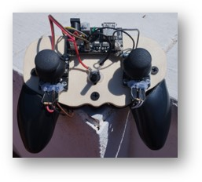
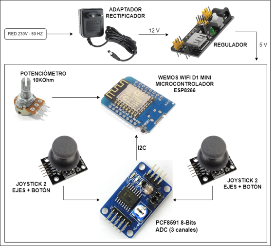
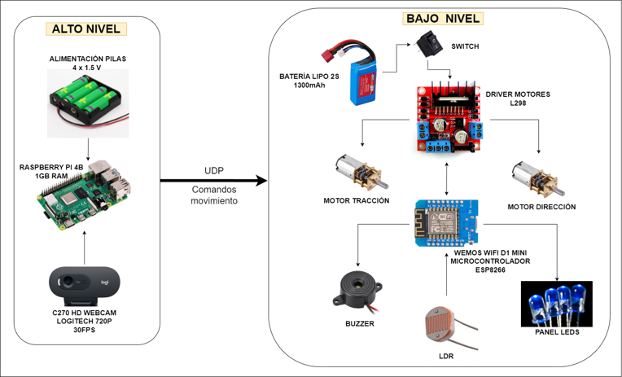
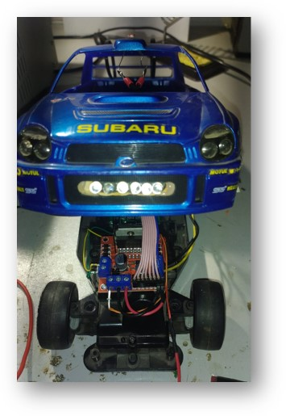
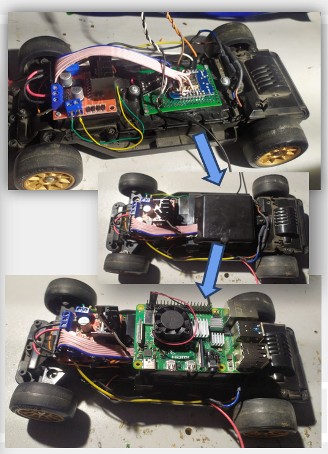
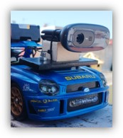
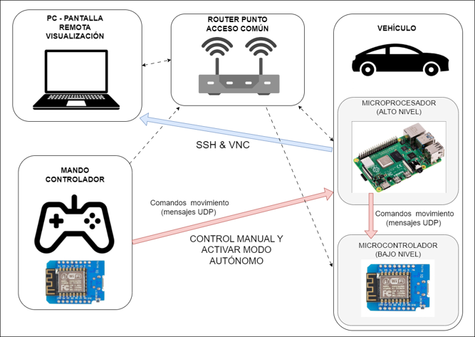
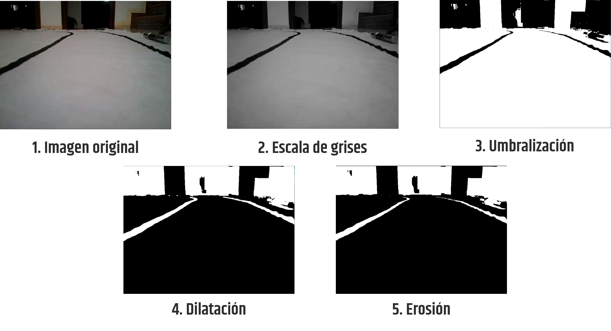
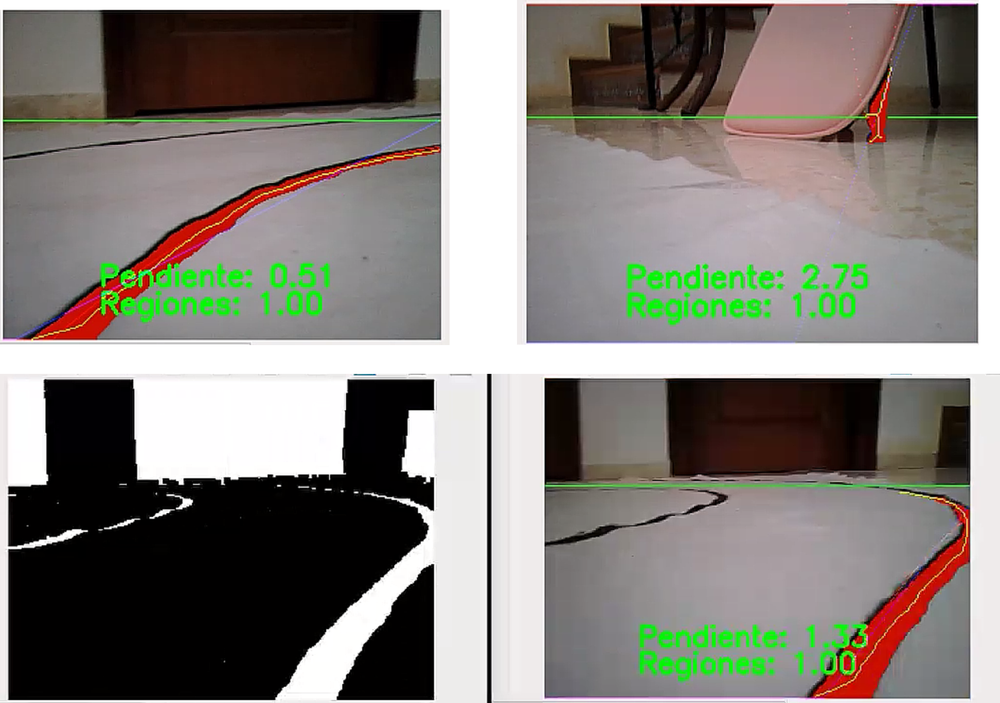

## Autonomous Vehicle Project: Control de Vehículos / Máster MIERA
#### Lane Detection and Tracking based on Image Processing
---
Starting from a toy RC car in Ackermann configuration, its chassis and motors will be used, adding all the necessary electronics to support lane detection and lane following functionality using image processing and computer vision. 

This will allow the vehicle to move within a defined lane autonomously. Experiments will be conducted on a circuit specifically designed to verify the system's performance.

##### DETAILED REPORT
More info about the project can be found on projectReport.pdf

##### FUNCTIONAL-DEMO VIDEO: 

##### AUTHORS
ÁLVARO GARCIA LORA 
SERGIO LEÓN DONCEL
JUAN ANTONIO CANO VÍLCHEZ 
